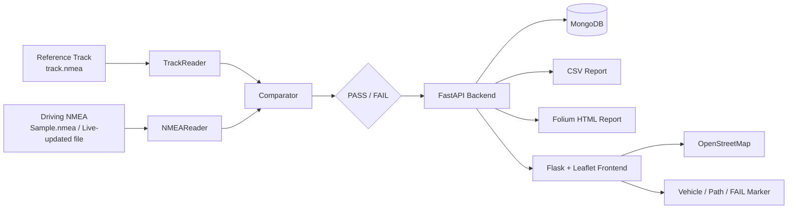

# 🚗 NMEA 기반 실시간 GNSS 데이터 검증 자동화 시스템

<p align="center">
  <b>GNSS 수신 여부 확인을 넘어, 실제 주행 위치 정확성까지 자동으로 검증하기 위한 Navigation Validation System</b>
</p>

<p align="center">
  
  
  
  
  
</p>

---

## 📌 프로젝트 한 줄 소개

`track.nmea` 기준 경로와 주행 중 수집된 NMEA 데이터를 시간 기준으로 동기화하여 **거리 오차, Heading 오차, GNSS Update Time**을 비교하고, 결과를 **PASS / FAIL 판정 → 실시간 지도 시각화 → MongoDB 저장 → CSV / HTML Report 생성**까지 자동화하는 프로젝트입니다.

```text
NMEA 입력
   ↓
기준 경로와 시간 동기화
   ↓
Distance / Heading / Update Time 비교
   ↓
PASS / FAIL
   ↓
실시간 지도 + Failure 표시
   ↓
MongoDB / CSV / HTML Report
```

---

## 🎯 왜 만들었나?

기존 GNSS 검증 환경에서는 장비를 이용해 **GNSS 신호가 정상적으로 수신되는지** 확인할 수 있지만, 실제 차량이 이동하는 환경에서 다음 항목을 자동으로 판단하기에는 한계가 있었습니다.

- 실제 위치가 기준 경로에서 벗어났는가?
- 차량 진행 방향(Heading)이 정상인가?
- GNSS 위치 Update 주기가 정상인가?
- 이상이 발생한 정확한 위치와 원인은 어디인가?
- 반복 주행 결과를 사람이 매번 수동으로 확인해야 하는가?

이 프로젝트는 이 문제를 해결하기 위해 **NMEA 데이터 자체를 기반으로 주행 정확성을 자동 판정하는 검증 시스템**을 구현한 것입니다.

> 목표는 단순히 **“GNSS가 수신된다”**를 확인하는 것이 아니라,
> **“실제 이동 환경에서 GNSS 위치가 얼마나 정확하게 동작하는가”**를 검증하는 것입니다.

---

## 🖥️ 실시간 검증 화면

<p align="center">
  
</p>

화면에서는 다음 내용을 한 번에 확인할 수 있습니다.

- 기준 경로(Reference Track)
- 현재 차량 위치 및 이동 경로
- 차량 진행 방향
- 현재 속도
- PASS / FAIL 결과
- 거리 이탈 위치
- Heading 이탈 위치
- Update Time 지연 위치
- Failure 원인

---

## ✨ 주요 기능

### 1. NMEA 데이터 파싱

`pynmea2`를 사용해 NMEA 문장을 읽고 GNSS 검증에 필요한 데이터를 추출합니다.

주요 대상 문장:

```text
GGA
RMC
VTG
GSA
GSV
```

검증에 사용하는 대표 데이터:

- Timestamp
- Latitude / Longitude
- Speed
- True Course / Heading
- Raw NMEA Sentence

현재 `NMEAReader`는 두 가지 실행 모드를 지원합니다.

| Mode | 설명 |
|---|---|
| `replay` | `Sample.nmea`를 처음부터 순차 재생하며 반복 주행 테스트 |
| `live` | 설정된 NMEA 파일을 다시 읽어 가장 최근의 유효 문장을 사용 |

> **현재 코드의 `live` 모드는 Serial/COM Port를 직접 읽는 방식이 아닙니다.** 실제 장비 연동 시에는 외부 수집 프로세스 또는 장비가 NMEA 입력 파일을 지속적으로 갱신하는 흐름을 전제로 합니다.

---

### 2. 기준 경로와 실제 주행 비교

기준 경로는 기본적으로 다음 파일에서 읽습니다.

```text
backend/nmea/track.nmea
```

실제 주행 데이터는 기본적으로 다음 파일을 사용합니다.

```text
backend/nmea/Sample.nmea
```

`TrackReader`가 기준 경로를 시간별 좌표와 Heading 정보로 변환하고, `Comparator`가 현재 GNSS 데이터와 비교합니다.

---

### 3. Comparator 기반 자동 PASS / FAIL 판정

현재 코드의 기본 검증 기준은 다음과 같습니다.

| 검증 항목 | 기본 기준 | 판정 목적 |
|---|---:|---|
| 시간 동기화 후보 | 기준 Timestamp ± 3초 | 실제 데이터와 비교할 기준점 탐색 |
| Distance | `< 5 m` | 실제 위치의 경로 이탈 여부 |
| Heading | `< 20°` | 차량 진행 방향 이상 여부 |
| Update Time | `≤ 4 sec` | GNSS 위치 갱신 지연 여부 |

최종 결과는 세 항목이 모두 정상일 때만 PASS입니다.

```text
Distance PASS
    AND
Heading PASS
    AND
Update Time PASS
        ↓
      PASS
```

하나라도 기준을 초과하면 FAIL로 판정하고 원인을 함께 기록합니다.

예:

```text
distance is over tolerance: 24.8m
heading is over tolerance: 68.4deg
update time is over tolerance: 7.2s
```

---

### 4. 실시간 지도 시각화

Frontend는 `Flask + Leaflet + OpenStreetMap`으로 구성되어 있습니다.

실시간 화면에서:

- 기준 경로를 표시하고
- 현재 차량 위치를 차량 아이콘으로 표시하며
- 실제 이동 경로를 Polyline으로 그리고
- FAIL 발생 지점을 Red Marker로 표시합니다.

FAIL Marker를 선택하면 위치, 속도, 방향, Failure Reason을 확인할 수 있습니다.

---

### 5. Replay / Live 검증 모드

화면에서 검증 모드를 선택할 수 있습니다.

#### 테스트 주행 (`replay`)

저장된 NMEA 데이터를 반복 재생하여 로직을 재현하고 테스트할 수 있습니다.

추천 용도:

- 개발 중 Comparator 로직 확인
- 동일 조건 회귀 테스트
- Demo / Portfolio 실행
- 기준값 변경 전후 비교

#### 실시간 검증 (`live`)

NMEA 입력 파일에서 최신 유효 데이터를 계속 읽어 검증합니다.

추천 용도:

- 외부 GNSS 수집 장비와 연계
- LabSat / OCU 시험 흐름과 결합
- 지속적으로 갱신되는 NMEA 데이터 모니터링

---

### 6. MongoDB 기반 검증 데이터 저장

MongoDB가 연결된 경우 검증 데이터를 다음 단위로 저장합니다.

```text
sessions
raw_nmea
drive_points
failures
reports
tracks
```

대표 저장 정보:

- Session ID
- Cycle
- Raw NMEA
- Latitude / Longitude
- Speed / Heading
- Distance 결과
- Heading 결과
- Update Time 결과
- PASS / FAIL
- Failure Reason
- Report Metadata

기본 연결 정보:

```text
MONGO_URI=mongodb://localhost:27017
MONGO_DB_NAME=driving_db
```

MongoDB가 실행되지 않아도 프로그램이 바로 종료되지 않고 **In-Memory Storage로 fallback**합니다.

> In-Memory 모드는 Demo에는 유용하지만 프로세스 종료 시 데이터가 유지되지 않습니다.

---

### 7. CSV Report 자동 생성

주행 중 각 검증 결과를 CSV에 누적합니다.

대표 컬럼:

```text
Cycle
Real Time
Timestamp
Latitude
Longitude
Speed(km/h)
Heading
Distance Pass
Distance(m)
Update Time Pass
Update Time Difference(s)
Heading Pass
Heading Difference(deg)
Result
Reason
```

화면의 **리포트 저장** 버튼으로 현재 CSV Report를 다운로드할 수 있습니다.

---

### 8. Cycle별 HTML 지도 Report

Cycle 종료 시 `Folium`을 이용해 HTML 지도 Report를 자동 생성합니다.

HTML Report에는:

- 기준 경로
- 실제 주행 경로
- FAIL Marker
- Failure Reason

이 포함됩니다.

기본 저장 위치는 Backend를 `backend` 디렉터리에서 실행했을 때:

```text
backend/track_comparison/
```

입니다.

---

## 🏗️ 시스템 아키텍처



### 데이터 처리 흐름

```text
1. track.nmea 로딩
        ↓
2. Sample.nmea 또는 최신 NMEA 입력
        ↓
3. Timestamp 기준 ±3초 후보 탐색
        ↓
4. Distance / Heading / Update Time 계산
        ↓
5. PASS / FAIL 판정
        ↓
6. FastAPI 상태 및 API 갱신
        ↓
7. Leaflet 실시간 화면 표시
        ↓
8. MongoDB + CSV + HTML 저장
```

---

## 📁 프로젝트 구조

```text
real_navigation/
│
├─ backend/
│  ├─ app/
│  │  ├─ main.py              # FastAPI 엔드포인트 / 주행 상태 관리
│  │  ├─ nmea_reader.py       # 실제/Replay NMEA 읽기 및 파싱
│  │  ├─ track_reader.py      # 기준 경로 로딩 및 Heading 계산
│  │  ├─ comporator.py        # 거리/Heading/Update Time 판정
│  │  ├─ db.py                # MongoDB + Memory fallback
│  │  └─ Save_map_html.py     # Cycle별 Folium HTML 지도 생성
│  │
│  ├─ services/
│  │  └─ report_generator.py  # CSV Report 생성
│  │
│  ├─ nmea/
│  │  ├─ track.nmea           # 기준 주행 경로
│  │  └─ Sample.nmea          # 검증용 NMEA 입력
│  │
│  ├─ reports/                # CSV Report
│  ├─ track_comparison/       # HTML 지도 Report
│  └─ requirements.txt
│
└─ flask_frontend/
   ├─ app.py                  # Flask Web Server
   ├─ templates/
   │  └─ map.html             # 실시간 검증 화면
   └─ static/
      ├─ js/map.js            # FastAPI polling / Leaflet 제어
      └─ image/car-icon.svg
```

---

# 🚀 실행 방법

## 1. Repository Clone

```bash
git clone https://github.com/tmdgns104/real_navigation.git
cd real_navigation
```

---

## 2. 가상환경 생성

### Windows CMD

```cmd
py -m venv .venv
.venv\Scripts\activate
```

### Linux / macOS

```bash
python3 -m venv .venv
source .venv/bin/activate
```

---

## 3. Dependency 설치

Repository Root에서:

```bash
pip install -r backend/requirements.txt
```

설치되는 주요 라이브러리:

```text
FastAPI
Uvicorn
PyNMEA2
Geopy
Folium
Flask
PyMongo
```

---

## 4. MongoDB 준비 - 선택 사항

MongoDB를 사용하려면 로컬 MongoDB를 먼저 실행합니다.

기본 설정:

```text
mongodb://localhost:27017
database: driving_db
```

다른 MongoDB를 사용할 경우 환경변수를 설정할 수 있습니다.

### Windows CMD

```cmd
set MONGO_URI=mongodb://localhost:27017
set MONGO_DB_NAME=driving_db
```

MongoDB가 없어도 In-Memory 모드로 실행할 수 있습니다.

---

## 5. FastAPI Backend 실행

첫 번째 Terminal:

```bash
cd backend
uvicorn app.main:app --reload --port 8000
```

정상 실행 후:

```text
http://127.0.0.1:8000
```

FastAPI Swagger UI:

```text
http://127.0.0.1:8000/docs
```

---

## 6. Flask Frontend 실행

두 번째 Terminal에서 Repository Root 기준:

```bash
cd flask_frontend
python app.py
```

Browser에서:

```text
http://127.0.0.1:5000
```

> Frontend JavaScript는 현재 FastAPI를 `http://localhost:8000`으로 호출하므로 Backend는 8000 Port로 실행하는 것을 권장합니다.

---

# 🎮 실제 사용 순서

## 테스트 주행

1. FastAPI Backend 실행
2. Flask Frontend 실행
3. Browser에서 `http://127.0.0.1:5000` 접속
4. 모드를 **테스트 주행**으로 선택
5. **주행 시작** 클릭
6. 지도에서 차량 이동 및 PASS / FAIL 확인
7. 필요하면 **화면 일시정지 / 화면 다시 시작** 사용
8. **리포트 저장**으로 CSV 다운로드
9. **주행 종료** 클릭

Replay 모드는 `Sample.nmea`의 끝까지 도달하면 하나의 Cycle을 완료하고 다시 처음부터 반복합니다.

---

## Live 검증

1. 외부 수집 프로세스 또는 장비가 NMEA 입력 파일을 지속적으로 갱신하도록 구성
2. 화면에서 **실시간 검증** 선택
3. **주행 시작** 클릭
4. Backend가 최신 NMEA 문장을 읽어 기준 Track과 비교
5. 실시간 PASS / FAIL 확인
6. 종료 후 CSV / HTML / MongoDB 결과 확인

---

## 🔌 주요 API

| Method | Endpoint | 설명 |
|---|---|---|
| `POST` | `/start-driving?mode=replay` | Replay 검증 시작 |
| `POST` | `/start-driving?mode=live` | Live 검증 시작 |
| `POST` | `/stop-driving` | 검증 종료 |
| `GET` | `/current` | 현재 GNSS / 판정 / 경로 / Failure 상태 |
| `GET` | `/track` | 기준 Track 조회 |
| `GET` | `/generate-excel` | CSV Report 다운로드 |
| `POST` | `/save-result` | Session Summary 저장 |
| `GET` | `/reports` | 저장된 Report 목록 |
| `GET` | `/report/{report_id}` | 특정 Report 조회 |

---

## 🧰 Tech Stack

| 영역 | 기술 |
|---|---|
| Language | Python, JavaScript |
| Backend API | FastAPI, Uvicorn |
| Web | Flask |
| Map | Leaflet, OpenStreetMap, Folium |
| GNSS / NMEA | pynmea2 |
| Distance | geopy |
| Database | MongoDB, PyMongo |
| Report | CSV, Folium HTML |

---

## 💡 이 프로젝트에서 구현한 핵심

### ✅ GNSS 데이터를 검증 가능한 형태로 변환

NMEA 문자열을 단순 출력하는 것이 아니라 위치, 시간, 속도, Heading을 구조화해 실제 검증 로직의 입력으로 사용했습니다.

### ✅ 기준 경로와 실제 주행 데이터를 자동 비교

Timestamp 후보를 찾은 뒤 거리, Heading, Update Time을 각각 판정해 사람이 지도를 눈으로 비교하던 작업을 자동화했습니다.

### ✅ FAIL 위치와 원인을 동시에 시각화

단순 PASS / FAIL 로그가 아니라 **어디에서 왜 실패했는지** 지도에서 확인할 수 있도록 구성했습니다.

### ✅ 검증 결과를 재사용 가능한 데이터로 저장

Raw NMEA, 주행 Point, Failure, Report Metadata를 분리해 MongoDB에 저장하고 CSV / HTML 결과도 함께 생성합니다.

### ✅ 동일 데이터를 Replay하여 반복 검증 가능

동일한 입력을 반복 실행할 수 있어 Comparator 로직 수정이나 기준값 변경 이후 결과를 다시 확인하기 쉽도록 구성했습니다.

---

## ⚠️ 현재 구현 범위

이 Repository의 현재 코드를 기준으로 다음 사항은 구분해서 보는 것이 좋습니다.

### 구현됨

- NMEA File Parsing
- Replay Mode
- 최신 File Data 기반 Live Mode
- Reference Track 비교
- Distance / Heading / Update Time 판정
- PASS / FAIL
- Leaflet 실시간 화면
- Failure Marker
- MongoDB 저장
- MongoDB 미연결 시 Memory fallback
- CSV Report
- Cycle별 Folium HTML Report

### 외부 장비/환경과 함께 구성해야 함

- 실제 OCU에서 NMEA 데이터를 가져오는 수집 계층
- LabSat RF GNSS 재생 환경
- Serial / COM Port 직접 수신

즉 이 Repository는 **GNSS 데이터를 입력받은 이후의 검증, 판정, 저장, 시각화 자동화 계층**을 중심으로 구현되어 있습니다.

---

## 🔭 향후 개선 방향

현재 Distance / Heading / Update Time 중심의 검증을 GNSS 품질 지표까지 확장할 수 있습니다.

예정/검토 항목:

- HDOP 품질 평가
- Satellite Count 분석
- GGA Quality / Fix 상태 검증
- TTFF(Time To First Fix) 측정
- Altitude 이상치 검출
- Speed 이상치 검출
- Heading / Update Time 통계화
- GNSS Quality Index 도입
- Serial/COM 기반 직접 NMEA 수신
- 테스트 자동 실행 및 회귀 검증 강화

궁극적으로는 여러 GNSS 품질 지표를 하나의 검증 파이프라인으로 통합하여 **GNSS Validation Automation System**으로 확장하는 것이 목표입니다.

---

## 📚 프로젝트 핵심 흐름 요약

```text
기준 경로 (track.nmea)
          │
          ├──────────────┐
          │              │
          ▼              ▼
     TrackReader     NMEAReader
                         │
                         ▼
                    실시간/Replay NMEA
                         │
          ┌──────────────┘
          ▼
      Comparator
          │
          ▼
Distance / Heading / Update Time
          │
          ▼
      PASS / FAIL
          │
     ┌────┼───────────────┐
     ▼    ▼               ▼
  Leaflet MongoDB      CSV / HTML
   Map    Storage        Report
```

---

<p align="center">
  <b>NMEA Based GNSS Validation Automation</b><br/>
  GNSS 수신 확인에서 한 단계 더 나아가, 실제 주행 위치 정확성을 자동으로 검증하기 위한 프로젝트
</p>
